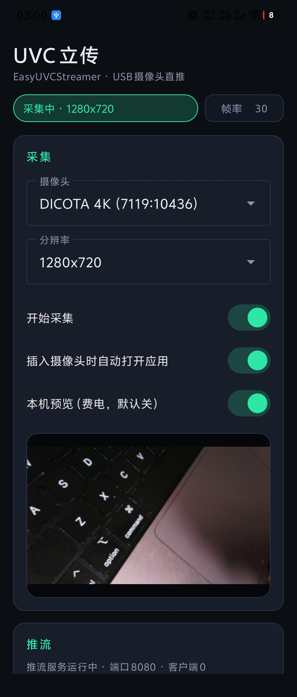
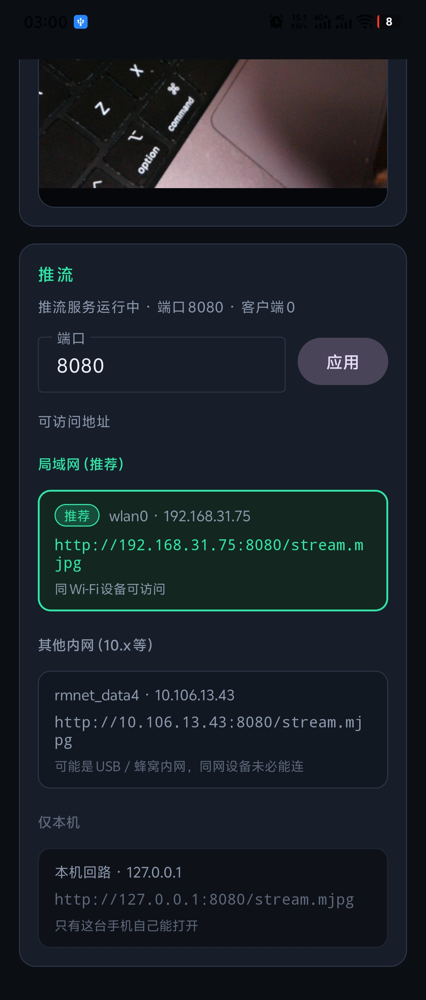

# EasyUVCStreamer（UVC 立传）

用 Android 手机当 USB Host，把 UVC 摄像头的 **原始 MJPEG** 低延迟推到局域网。

桌面显示名：**UVC 立传** · 工程名：**EasyUVCStreamer**

<p align="center">
  
  
</p>

## 能做什么

- 枚举 / 打开 USB UVC 设备，协商 MJPEG 分辨率并开流
- **HTTP MJPEG 直推**（`multipart/x-mixed-replace`），浏览器或播放器直接打开
- 启动后自动开 HTTP 服务；可改端口；按网卡列出可访问地址（点按复制）
- 本机预览默认关闭（避免解码费电）；需要时再开
- 可选：插入摄像头时由系统唤起 App 并尝试开流

主线不做转码：摄像头 → 原始 JPEG → 网络。没有订阅客户端时，采集回调里尽量不额外拷贝帧。

## 环境要求

- Android **8.0+**（`minSdk 28`），设备需支持 **USB Host**
- Android Studio + NDK（当前工程默认指向本机 NDK 路径，可按机器修改）
- [vcpkg](https://vcpkg.io/)，并设置环境变量 `VCPKG_ROOT`（未设置时默认 `~/vcpkg`）

Native 依赖（manifest 模式，构建时自动拉取）：

- libusb / libuvc（含 Android isoch 相关 overlay）
- libhv（HTTP 服务）

## 构建

```bash
# 确认 VCPKG_ROOT
echo $VCPKG_ROOT

# Android Studio 打开工程，或：
./gradlew :app:assembleDebug
```

如 NDK 路径与 `app/build.gradle.kts` 里写死的不一致，请改成你的本机路径后再编。

ABI：`arm64-v8a`、`x86_64`。

## 使用

1. 授权相机 / 录音（部分机型插 UVC 会提示麦克风；视频主线仍可用）
2. 插入 UVC 摄像头并授予 USB 权限
3. 选择分辨率，打开「开始采集」
4. 在「推流」区查看地址，例如：

   `http://<手机局域网IP>:8080/stream.mjpg`

5. 同网电脑用浏览器、VLC 等打开上述 URL

可选页面：`http://<IP>:8080/`（简单预览页）· `http://<IP>:8080/status`（JSON 状态）

## 结构概览

```
app/src/main/
  java/.../          # UI、USB、会话、HTTP 控制器
  cpp/               # JNI、libuvc 采集、帧管线、libhv MJPEG 服务
  cpp/overlay-ports/ # libuvc Android 补丁（iso transfer 等）
images/              # 截图
```

## 许可

本项目以 [AGPL-3.0](LICENSE) 发布。若你基于本项目提供网络服务，需遵守 AGPL 对源码公开的要求。
